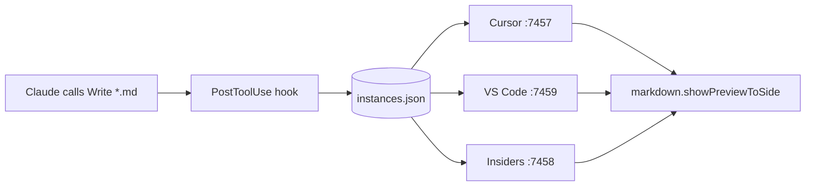
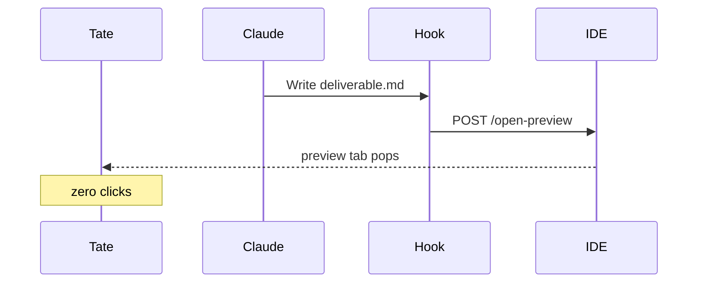

# Mermaid-in-Markdown Smoke Test

Below should render as a flowchart (not source code) if `bierner.markdown-mermaid` activated:

```mermaid
flowchart LR
  Write[Claude calls Write *.md]
  Hook[PostToolUse hook]
  Reg[(instances.json)]
  C[Cursor :7457]
  S[VS Code :7459]
  I[Insiders :7458]
  Pop[markdown.showPreviewToSide]

  Write --> Hook
  Hook --> Reg
  Reg --> C & S & I
  C --> Pop
  S --> Pop
  I --> Pop
```

```mermaid
sequenceDiagram
  participant T as Tate
  participant Claude
  participant Hook
  participant IDE

  Claude->>Hook: Write deliverable.md
  Hook->>IDE: POST /open-preview
  IDE-->>T: preview tab pops
  Note over T: zero clicks
```

If diagrams render: mermaid pipeline live.
